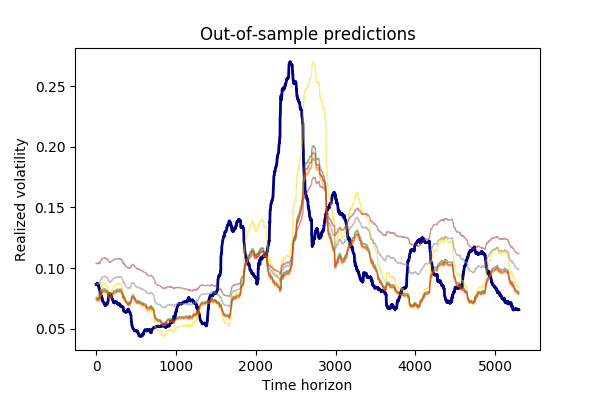
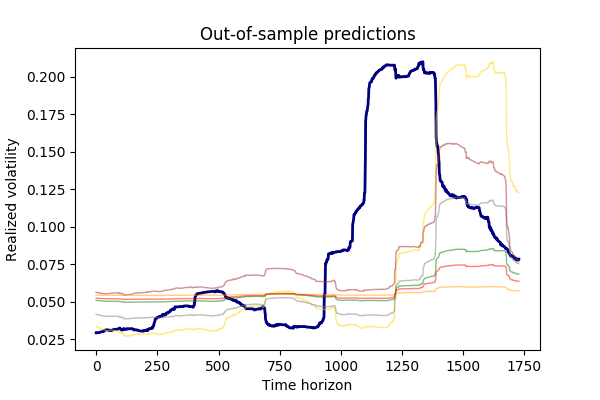
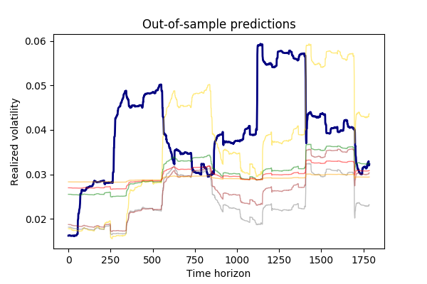

[](http://quantlet.de/)

## [](http://quantlet.de/) **RVOLaccur** [](http://quantlet.de/)

```yaml


Name of Quantlet: RVOLaccur

Published in: Master thesis

Description: checks the predicting accuracy of various models through Diebold Mariano tests. All forecasts are plotted next to the target value as well. 

Keywords: cryptocurrency, RNN, LSTM, GRU, DM, test, Diebold, Mariano, HAR, FNN

Author: Ivan Mitkov

Submitted:  Fri, January 11 2019 by Ivan Mitkov

Datafile: rnn_outofsample_predictions_high_vol_long.csv, rnn_outofsample_predictions_high_vol_short.csv, rnn_outofsample_predictions_low_vol_long.csv, rnn_outofsample_predictions_low_vol_short.csv, harfnn_outofsample_predictions_high_vol_long.csv, harfnn_outofsample_predictions_high_vol_short.csv, harfnn_outofsample_predictions_low_vol_long.csv, harfnn_outofsample_predictions_low_vol_short.csv

Output: high_volatility_long.png, high_volatility_short.png, low_volatility_long.png, low_volatility_short.png

```








### PYTHON Code
```python

#!/usr/bin/env python3
# -*- coding: utf-8 -*-
"""
Created on Sat Nov 24 18:37:02 2018

@author: ivanmitkov
"""

def dm_test(actual_lst, prediction_1, prediction_2, horizon = 1, power = 2):

    # Import libraries
    from scipy.stats import t
    import collections
    import pandas as pd
    import numpy as np
    
    # Initialise lists
    e1_lst = []
    e2_lst = []
    d_lst  = []
    
    # convert every value of the lists into real values
    actual_lst = pd.Series(actual_lst).apply(lambda x: float(x)).tolist()
    prediction_1 = pd.Series(prediction_1).apply(lambda x: float(x)).tolist()
    prediction_2 = pd.Series(prediction_2).apply(lambda x: float(x)).tolist()
    
    # Length of lists (as real numbers)
    T = float(len(actual_lst))
    
    # construct d according to crit
    for actual,p1,p2 in zip(actual_lst,prediction_1,prediction_2):
        e1_lst.append((actual - p1)**2)
        e2_lst.append((actual - p2)**2)
    for e1, e2 in zip(e1_lst, e2_lst):
        d_lst.append(e1 - e2)
  
    
    # Mean of d        
    mean_d = pd.Series(d_lst).mean()
    
    # Find autocovariance and construct DM test statistics
    def autocovariance(Xi, N, k, Xs):
        autoCov = 0
        T = float(N)
        for i in np.arange(0, N-k):
              autoCov += ((Xi[i+k])-Xs)*(Xi[i]-Xs)
        return (1/(T))*autoCov
    gamma = []
    for lag in range(0,horizon):
        gamma.append(autocovariance(d_lst,len(d_lst),lag,mean_d)) # 0, 1, 2
    V_d = (gamma[0] + 2*sum(gamma[1:]))/T
    DM_stat=V_d**(-0.5)*mean_d
    harvey_adj=((T+1-2*horizon+horizon*(horizon-1)/T)/T)**(0.5)
    DM_stat = harvey_adj*DM_stat
    
    # Find p-value
    p_value = 2*t.cdf(-abs(DM_stat), df = T - 1)
    
    # Construct named tuple for return
    dm_return = collections.namedtuple('dm_return', 'DM p_value')
    
    rt = dm_return(DM = DM_stat, p_value = p_value)
    
    return rt
    
# Actual analysis
        
import warnings
warnings.simplefilter(action='ignore', category=FutureWarning)

# Set wordking directiory
import os

# Please note that the code works without any errors only if you run the whole script at once
os.chdir(os.path.dirname(__file__))

# If you run partial codes then you have to replace manually the working directory with your path
# os.chdir(r'/hier/comes/your/path/link')

# Impot of packages
from dalib.packages import *

# In order to keep constant outputs, avoiding different weights initialization
from numpy.random import seed
seed(1)

# 1. High volatility time longer training data set
harfnn = pd.read_csv(r'data/harfnn_outofsample_predictions_high_vol_long.csv', sep = ';')
rnn = pd.read_csv(r'data/rnn_outofsample_predictions_high_vol_long.csv', sep = ';')
del rnn['DAILY_RV']

# Predictions
df = pd.concat([harfnn, rnn], axis = 1)
del df['Unnamed: 0']

models_list = ['NAIVE', 'HAR', 'FNN-HAR', 'SRN', 'LSTM', 'GRU']
for model in models_list:
    rest = [n for n in models_list if n != model]
    for rest_model in rest:
        print('\nDiebold-Mariano test for forecasting accuracy \n\n\n',
              'Model to test: ', model, ' and ', rest_model, '\n',
              'Test statistic: ', dm_test(actual_lst = df['DAILY_RV'], prediction_1 = df[model],
                      prediction_2 = df[rest_model], horizon = 288)[0], '\n',
              'P value: ', dm_test(actual_lst = df['DAILY_RV'], prediction_1 = df[model],
                      prediction_2 = df[rest_model], horizon = 288)[1], '\n',
              '---------------------------------------------------')

# Visualization
plt.figure(dpi = 100)
plt.plot(df['DAILY_RV'], linewidth = 2, color = 'navy')
plt.plot(df['NAIVE'], linewidth = 1, color = 'gold', alpha=0.5)
plt.plot(df['HAR'], linewidth=1, color = 'gray', alpha=0.5)
plt.plot(df['FNN-HAR'], linewidth=1, color = 'brown', alpha=0.5)
plt.plot(df['SRN'], linewidth=1, color = 'green', alpha=0.5)
plt.plot(df['LSTM'], linewidth=1, color = 'orange', alpha=0.5)
plt.plot(df['GRU'], linewidth=1, color = 'red', alpha=0.5)
plt.ylabel('Realized volatility')
plt.xlabel('Time horizon')
plt.title('Out-of-sample predictions')
plt.savefig('high_volatility_long.png')
plt.show()


# 2. High volatility time longer training data set
harfnn = pd.read_csv(r'data/harfnn_outofsample_predictions_high_vol_short.csv', sep = ';')
rnn = pd.read_csv(r'data/rnn_outofsample_predictions_high_vol_short.csv', sep = ';')
del rnn['DAILY_RV']

# Predictions
df = pd.concat([harfnn, rnn], axis = 1)
del df['Unnamed: 0']

models_list = ['NAIVE', 'HAR', 'FNN-HAR', 'SRN', 'LSTM', 'GRU']
for model in models_list:
    rest = [n for n in models_list if n != model]
    for rest_model in rest:
        print('\nDiebold-Mariano test for forecasting accuracy \n\n\n',
              'Model to test: ', model, ' and ', rest_model, '\n',
              'Test statistic: ', dm_test(actual_lst = df['DAILY_RV'], prediction_1 = df[model],
                      prediction_2 = df[rest_model], horizon = 288)[0], '\n',
              'P value: ', dm_test(actual_lst = df['DAILY_RV'], prediction_1 = df[model],
                      prediction_2 = df[rest_model], horizon = 288)[1], '\n',
              '---------------------------------------------------')

# Visualization
plt.figure(dpi = 100)
plt.plot(df['DAILY_RV'], linewidth = 2, color = 'navy')
plt.plot(df['NAIVE'], linewidth = 1, color = 'gold', alpha=0.5)
plt.plot(df['HAR'], linewidth=1, color = 'gray', alpha=0.5)
plt.plot(df['FNN-HAR'], linewidth=1, color = 'brown', alpha=0.5)
plt.plot(df['SRN'], linewidth=1, color = 'green', alpha=0.5)
plt.plot(df['LSTM'], linewidth=1, color = 'orange', alpha=0.5)
plt.plot(df['GRU'], linewidth=1, color = 'red', alpha=0.5)
plt.ylabel('Realized volatility')
plt.xlabel('Time horizon')
plt.title('Out-of-sample predictions')
plt.savefig('high_volatility_short.png')
plt.show()


# 3. Low volatility time longer training data set
harfnn = pd.read_csv(r'data/harfnn_outofsample_predictions_low_vol_long.csv', sep = ';')
rnn = pd.read_csv(r'data/rnn_outofsample_predictions_low_vol_long.csv', sep = ';')
del rnn['DAILY_RV']

# Predictions
df = pd.concat([harfnn, rnn], axis = 1)
del df['Unnamed: 0']

models_list = ['NAIVE', 'HAR', 'FNN-HAR', 'SRN', 'LSTM', 'GRU']
for model in models_list:
    rest = [n for n in models_list if n != model]
    for rest_model in rest:
        print('\nDiebold-Mariano test for forecasting accuracy \n\n\n',
              'Model to test: ', model, ' and ', rest_model, '\n',
              'Test statistic: ', dm_test(actual_lst = df['DAILY_RV'], prediction_1 = df[model],
                      prediction_2 = df[rest_model], horizon = 288)[0], '\n',
              'P value: ', dm_test(actual_lst = df['DAILY_RV'], prediction_1 = df[model],
                      prediction_2 = df[rest_model], horizon = 288)[1], '\n',
              '---------------------------------------------------')

# Visualization
plt.figure(dpi = 100)
plt.plot(df['DAILY_RV'], linewidth = 2, color = 'navy')
plt.plot(df['NAIVE'], linewidth = 1, color = 'gold', alpha=0.5)
plt.plot(df['HAR'], linewidth=1, color = 'gray', alpha=0.5)
plt.plot(df['FNN-HAR'], linewidth=1, color = 'brown', alpha=0.5)
plt.plot(df['SRN'], linewidth=1, color = 'green', alpha=0.5)
plt.plot(df['LSTM'], linewidth=1, color = 'orange', alpha=0.5)
plt.plot(df['GRU'], linewidth=1, color = 'red', alpha=0.5)
plt.ylabel('Realized volatility')
plt.xlabel('Time horizon')
plt.title('Out-of-sample predictions')
plt.savefig('low_volatility_long.png')
plt.show()


# 4. Low volatility time longer training data set
harfnn = pd.read_csv(r'data/harfnn_outofsample_predictions_low_vol_short.csv', sep = ';')
rnn = pd.read_csv(r'data/rnn_outofsample_predictions_low_vol_short.csv', sep = ';')
del rnn['DAILY_RV']

# Predictions
df = pd.concat([harfnn, rnn], axis = 1)
del df['Unnamed: 0']

models_list = ['NAIVE', 'HAR', 'FNN-HAR', 'SRN', 'LSTM', 'GRU']
for model in models_list:
    rest = [n for n in models_list if n != model]
    for rest_model in rest:
        print('\nDiebold-Mariano test for forecasting accuracy \n\n\n',
              'Model to test: ', model, ' and ', rest_model, '\n',
              'Test statistic: ', dm_test(actual_lst = df['DAILY_RV'], prediction_1 = df[model],
                      prediction_2 = df[rest_model], horizon = 288)[0], '\n',
              'P value: ', dm_test(actual_lst = df['DAILY_RV'], prediction_1 = df[model],
                      prediction_2 = df[rest_model], horizon = 288)[1], '\n',
              '---------------------------------------------------')

# Visualization
plt.figure(dpi = 100)
plt.plot(df['DAILY_RV'], linewidth = 2, color = 'navy')
plt.plot(df['NAIVE'], linewidth = 1, color = 'gold', alpha=0.5)
plt.plot(df['HAR'], linewidth=1, color = 'gray', alpha=0.5)
plt.plot(df['FNN-HAR'], linewidth=1, color = 'brown', alpha=0.5)
plt.plot(df['SRN'], linewidth=1, color = 'green', alpha=0.5)
plt.plot(df['LSTM'], linewidth=1, color = 'orange', alpha=0.5)
plt.plot(df['GRU'], linewidth=1, color = 'red', alpha=0.5)
plt.ylabel('Realized volatility')
plt.xlabel('Time horizon')
plt.title('Out-of-sample predictions')
plt.savefig('low_volatility_short.png')
plt.show()

```

automatically created on 2019-01-18