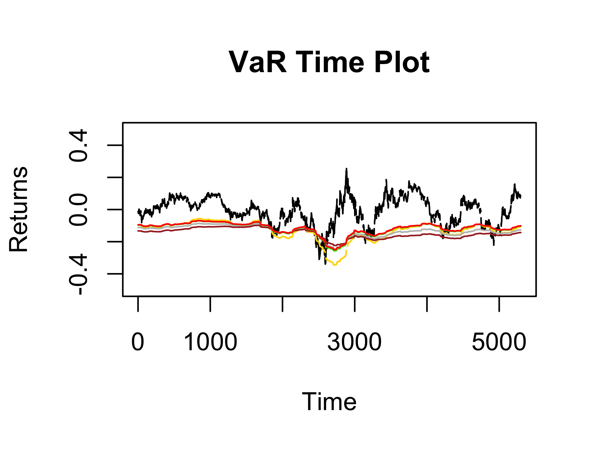
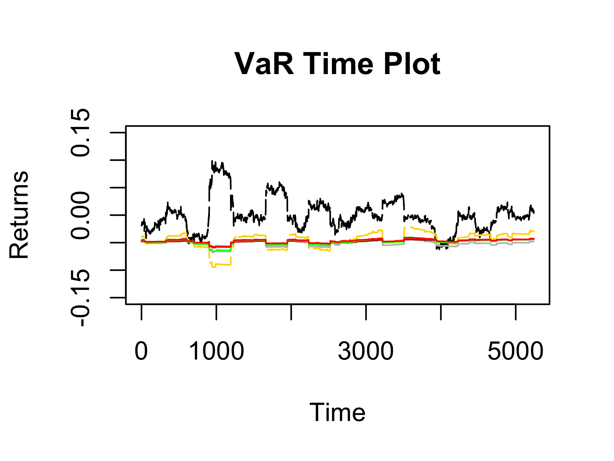
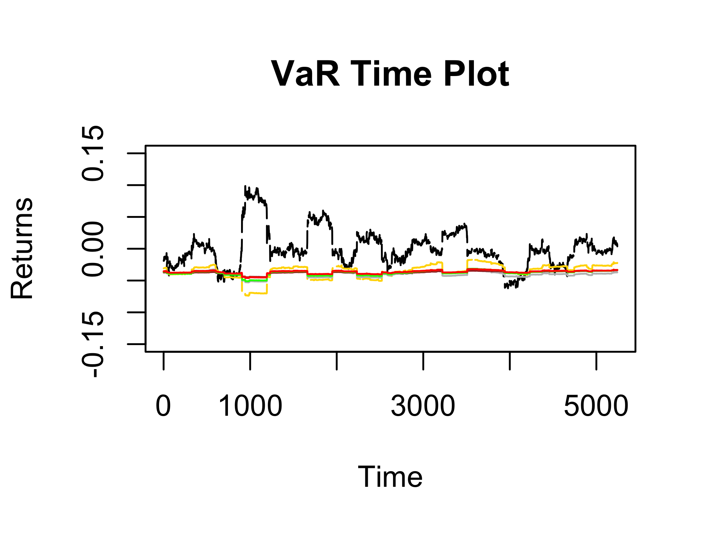

[](http://quantlet.de/)

## [](http://quantlet.de/) **RVOLbackt** [](http://quantlet.de/)

```yaml


Name of Quantlet: RVOLbackt

Published in: Master thesis

Description: tests if the realized volatility is a good approach for calculating Value at Risk. Backtesting algorithms like unconditional convergence test (Kupiec test) and conditional convergence test (Christoffersen test) are applied.

Keywords: cryptocurrency, RV, realized, volatility, VaR, backtests, backtesting, Kupiec, Christoffersen, value, risk

Author: Ivan Mitkov

Submitted: Fri, January 11 2019 by Ivan Mitkov

Datafile: forecasts_high_vol.csv, forecasts_low_vol.csv

Output: VaR_plot_high_005.png, VaR_plot_high_010.png, VaR_plot_low_005.png, VaR_plot_low_010.png
```









### R Code
```r

# Clear workspace
rm(list = ls())

# Import/install pacckages
install.packages("GAS")
install.packages("PerformanceAnalytics")
install.packages("rugarch")
install.packages("xts")
install.packages("actuar")
library(GAS)
library(rugarch)
library(dplyr)
library(xts)
library(actuar)

# Working directory
setwd("/Users/ivanmitkov/Desktop/repository/quantlets/RVOLbackt")
getwd()

# VaR HIGH, alpha = 0.05
forecasts = read.csv("data/forecasts_high_vol.csv", header = TRUE, sep = ";")

# Calculating and plotting VaR
VaR_NAIVE005 = 0 + qnorm(0.05) * forecasts$NAIVE
VaR_HAR005 = 0 + qnorm(0.05) * forecasts$HAR
VaR_FNNHAR005 = 0 + qnorm(0.05) * forecasts$FNNHAR
VaR_SRN005 = 0 + qnorm(0.05) * forecasts$SRN
VaR_LSTM005 = 0 + qnorm(0.05) * forecasts$LSTM
VaR_GRU005 = 0 + qnorm(0.05) * forecasts$GRU

# Plot
png(filename = "VaR_plot_high_005.png", width = 4, height = 3, units = 'in', res = 500)
plot(forecasts$DAILY_RETURNS, col = "black", type = "l", lty = "longdash", ylim = c(-0.5, 0.5), main = "VaR Time Plot", 
    xlab = "Time", ylab = "Returns")
lines(VaR_NAIVE005, col = "gold", type = "l", lty = "longdash", main = "VaR Time Plot", xlab = "Time", ylab = "Returns")
lines(VaR_HAR005, col = "grey", type = "l", lty = "longdash", main = "VaR Time Plot", xlab = "Time", ylab = "Returns")
lines(VaR_FNNHAR005, col = "brown", type = "l", lty = "longdash", main = "VaR Time Plot", xlab = "Time", ylab = "Returns")
lines(VaR_SRN005, col = "green", type = "l", lty = "longdash", main = "VaR Time Plot", xlab = "Time", ylab = "Returns")
lines(VaR_LSTM005, col = "orange", type = "l", lty = "longdash", main = "VaR Time Plot", xlab = "Time", ylab = "Returns")
lines(VaR_GRU005, col = "red", type = "l", lty = "longdash", main = "VaR Time Plot", xlab = "Time", ylab = "Returns")
dev.off()

VaR05 = forecasts[1:2500, ]
listcols = colnames(VaR05)
listcols = listcols[-c(1:2)]
listcols = listcols[listcols != "DAILY_RETURNS"]
actual = as.numeric(VaR05$DAILY_RETURNS)
for (i in listcols) {
    VaR05[[i]] = 0 + qnorm(0.05) * VaR05[[i]]
    VaR05[[i]] = xts(x = VaR05[[i]], order.by = as.Date(VaR05$DATE))
    cat("\n", i, "\n", "Expected exceed: ", VaRTest(alpha = 0.05, actual = actual, VaR = as.numeric(VaR05[[i]]))$expected.exceed, 
        "\n", "Actual exceed: ", VaRTest(alpha = 0.05, actual = actual, VaR = as.numeric(VaR05[[i]]))$actual.exceed, 
        "\n", "Unconditional coverage: ", VaRTest(alpha = 0.05, actual = actual, VaR = as.numeric(VaR05[[i]]))$uc.LRp, 
        "\n", "Conditional coverage: ", VaRTest(alpha = 0.05, actual = actual, VaR = as.numeric(VaR05[[i]]))$cc.LRp, 
        "\n\n\n")
}

# VaR HIGH, alpha = 0.10
forecasts = read.csv("data/forecasts_high_vol.csv", header = TRUE, sep = ";")
VaR_NAIVE010 = 0 + qnorm(0.1) * forecasts$NAIVE
VaR_HAR010 = 0 + qnorm(0.1) * forecasts$HAR
VaR_FNNHAR010 = 0 + qnorm(0.1) * forecasts$FNNHAR
VaR_SRN010 = 0 + qnorm(0.1) * forecasts$SRN
VaR_LSTM010 = 0 + qnorm(0.1) * forecasts$LSTM
VaR_GRU010 = 0 + qnorm(0.1) * forecasts$GRU

# Plot
png(filename = "VaR_plot_high_010.png", width = 4, height = 3, units = 'in', res = 500)
plot(forecasts$DAILY_RETURNS, col = "black", type = "l", lty = "longdash", ylim = c(-0.5, 0.5), main = "VaR Time Plot", 
    xlab = "Time", ylab = "Returns")
lines(VaR_NAIVE010, col = "gold", type = "l", lty = "longdash", main = "VaR Time Plot", xlab = "Time", ylab = "Returns")
lines(VaR_HAR010, col = "grey", type = "l", lty = "longdash", main = "VaR Time Plot", xlab = "Time", ylab = "Returns")
lines(VaR_FNNHAR010, col = "brown", type = "l", lty = "longdash", main = "VaR Time Plot", xlab = "Time", ylab = "Returns")
lines(VaR_SRN010, col = "green", type = "l", lty = "longdash", main = "VaR Time Plot", xlab = "Time", ylab = "Returns")
lines(VaR_LSTM010, col = "orange", type = "l", lty = "longdash", main = "VaR Time Plot", xlab = "Time", ylab = "Returns")
lines(VaR_GRU010, col = "red", type = "l", lty = "longdash", main = "VaR Time Plot", xlab = "Time", ylab = "Returns")
dev.off()

VaR010 = forecasts[1:2500, ]
listcols = colnames(VaR010)
listcols = listcols[-c(1:2)]
listcols = listcols[listcols != "DAILY_RETURNS"]
actual = as.numeric(VaR010$DAILY_RETURNS)
for (i in listcols) {
    VaR010[[i]] = 0 + qnorm(0.1) * VaR010[[i]]
    VaR010[[i]] = xts(x = VaR010[[i]], order.by = as.Date(VaR010$DATE))
    cat("\n", i, "\n", "Expected exceed: ", VaRTest(alpha = 0.1, actual = actual, VaR = as.numeric(VaR010[[i]]))$expected.exceed, 
        "\n", "Actual exceed: ", VaRTest(alpha = 0.1, actual = actual, VaR = as.numeric(VaR010[[i]]))$actual.exceed, 
        "\n", "Unconditional coverage: ", VaRTest(alpha = 0.1, actual = actual, VaR = as.numeric(VaR010[[i]]))$uc.LRp, 
        "\n", "Conditional coverage: ", VaRTest(alpha = 0.1, actual = actual, VaR = as.numeric(VaR010[[i]]))$cc.LRp, 
        "\n\n\n")
}

# VaR LOW, alpha = 0.05
forecasts = read.csv("data/forecasts_low_vol.csv", header = TRUE, sep = ";")

# Calculating and plotting VaR
VaR_NAIVE005 = 0 + qnorm(0.05) * forecasts$NAIVE
VaR_HAR005 = 0 + qnorm(0.05) * forecasts$HAR
VaR_FNNHAR005 = 0 + qnorm(0.05) * forecasts$FNNHAR
VaR_SRN005 = 0 + qnorm(0.05) * forecasts$SRN
VaR_LSTM005 = 0 + qnorm(0.05) * forecasts$LSTM
VaR_GRU005 = 0 + qnorm(0.05) * forecasts$GRU

# Plot
png(filename = "VaR_plot_low_005.png", width = 4, height = 3, units = 'in', res = 500)
plot(forecasts$DAILY_RETURNS, col = "black", type = "l", lty = "longdash", ylim = c(-0.15, 0.15), main = "VaR Time Plot", 
    xlab = "Time", ylab = "Returns")
lines(VaR_NAIVE005, col = "gold", type = "l", lty = "longdash", main = "VaR Time Plot", xlab = "Time", ylab = "Returns")
lines(VaR_HAR005, col = "grey", type = "l", lty = "longdash", main = "VaR Time Plot", xlab = "Time", ylab = "Returns")
lines(VaR_FNNHAR005, col = "brown", type = "l", lty = "longdash", main = "VaR Time Plot", xlab = "Time", ylab = "Returns")
lines(VaR_SRN005, col = "green", type = "l", lty = "longdash", main = "VaR Time Plot", xlab = "Time", ylab = "Returns")
lines(VaR_LSTM005, col = "orange", type = "l", lty = "longdash", main = "VaR Time Plot", xlab = "Time", ylab = "Returns")
lines(VaR_GRU005, col = "red", type = "l", lty = "longdash", main = "VaR Time Plot", xlab = "Time", ylab = "Returns")
dev.off()

VaR005 = forecasts[1:2500, ]
listcols = colnames(VaR005)
listcols = listcols[-c(1:2)]
listcols = listcols[listcols != "DAILY_RETURNS"]
actual = as.numeric(VaR005$DAILY_RETURNS)
for (i in listcols) {
    VaR005[[i]] = 0 + qnorm(0.05) * VaR005[[i]]
    VaR005[[i]] = xts(x = VaR005[[i]], order.by = as.Date(VaR005$DATE))
    cat("\n", i, "\n", "Expected exceed: ", VaRTest(alpha = 0.05, actual = actual, VaR = as.numeric(VaR005[[i]]))$expected.exceed, 
        "\n", "Actual exceed: ", VaRTest(alpha = 0.05, actual = actual, VaR = as.numeric(VaR005[[i]]))$actual.exceed, 
        "\n", "Unconditional coverage: ", VaRTest(alpha = 0.05, actual = actual, VaR = as.numeric(VaR005[[i]]))$uc.LRp, 
        "\n", "Conditional coverage: ", VaRTest(alpha = 0.05, actual = actual, VaR = as.numeric(VaR005[[i]]))$cc.LRp, 
        "\n\n\n")
}

# VaR LOW, alpha = 0.10
forecasts = read.csv("data/forecasts_low_vol.csv", header = TRUE, sep = ";")
VaR_NAIVE010 = 0 + qnorm(0.1) * forecasts$NAIVE
VaR_HAR010 = 0 + qnorm(0.1) * forecasts$HAR
VaR_FNNHAR010 = 0 + qnorm(0.1) * forecasts$FNNHAR
VaR_SRN010 = 0 + qnorm(0.1) * forecasts$SRN
VaR_LSTM010 = 0 + qnorm(0.1) * forecasts$LSTM
VaR_GRU010 = 0 + qnorm(0.1) * forecasts$GRU

# Plot
png(filename = "VaR_plot_low_010.png", width = 4, height = 3, units = 'in', res = 500)
plot(forecasts$DAILY_RETURNS, col = "black", type = "l", lty = "longdash", ylim = c(-0.15, 0.15), main = "VaR Time Plot", 
    xlab = "Time", ylab = "Returns")
lines(VaR_NAIVE010, col = "gold", type = "l", lty = "longdash", main = "VaR Time Plot", xlab = "Time", ylab = "Returns")
lines(VaR_HAR010, col = "grey", type = "l", lty = "longdash", main = "VaR Time Plot", xlab = "Time", ylab = "Returns")
lines(VaR_FNNHAR010, col = "brown", type = "l", lty = "longdash", main = "VaR Time Plot", xlab = "Time", ylab = "Returns")
lines(VaR_SRN010, col = "green", type = "l", lty = "longdash", main = "VaR Time Plot", xlab = "Time", ylab = "Returns")
lines(VaR_LSTM010, col = "orange", type = "l", lty = "longdash", main = "VaR Time Plot", xlab = "Time", ylab = "Returns")
lines(VaR_GRU010, col = "red", type = "l", lty = "longdash", main = "VaR Time Plot", xlab = "Time", ylab = "Returns")
dev.off()

VaR010 = forecasts[1:2500, ]
listcols = colnames(VaR010)
listcols = listcols[-c(1:2)]
listcols = listcols[listcols != "DAILY_RETURNS"]
actual = as.numeric(VaR010$DAILY_RETURNS)
for (i in listcols) {
    VaR010[[i]] = 0 + qnorm(0.1) * VaR010[[i]]
    VaR010[[i]] = xts(x = VaR010[[i]], order.by = as.Date(VaR010$DATE))
    cat("\n", i, "\n", "Expected exceed: ", VaRTest(alpha = 0.1, actual = actual, VaR = as.numeric(VaR010[[i]]))$expected.exceed, 
        "\n", "Actual exceed: ", VaRTest(alpha = 0.1, actual = actual, VaR = as.numeric(VaR010[[i]]))$actual.exceed, 
        "\n", "Unconditional coverage: ", VaRTest(alpha = 0.1, actual = actual, VaR = as.numeric(VaR010[[i]]))$uc.LRp, 
        "\n", "Conditional coverage: ", VaRTest(alpha = 0.1, actual = actual, VaR = as.numeric(VaR010[[i]]))$cc.LRp, 
        "\n\n\n")
}

```

automatically created on 2019-01-14