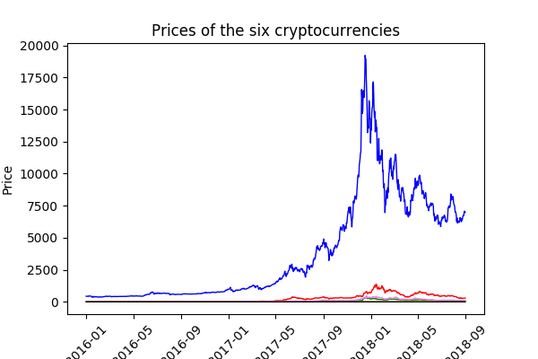
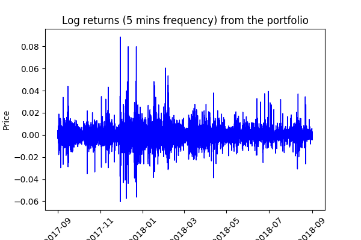
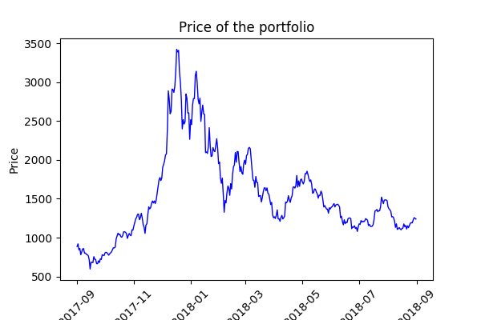

[](http://quantlet.de/)

## [](http://quantlet.de/) **RVOLprep** [](http://quantlet.de/)

```yaml


Name of Quantlet: RVOLprep

Published in: Master thesis

Description: imports the raw data from six cryptocurrencies, builds a price weighted portfolio from all of them and calculated log returns and realized volatility. Additionally, it gives more information about the data with some graphs and descriptive statitstics. 

Keywords: cryptocurrency, returns, RV, realized, volatility, price, weighted, portfolio

Author: Ivan Mitkov

Submitted:  Fri, January 11 2019 by Ivan Mitkov

Datafile: price_btc_eth_ltc_str_xmr_xrp_20160101_20180831.p

Output: 
- crypto_price_evolution.png,
- portfolio_daily_logreturns.png,
- portfolio_prices.png

```







### PYTHON Code
```python

#!/usr/bin/env python3
# -*- coding: utf-8 -*-

import warnings
warnings.simplefilter(action='ignore', category=FutureWarning)

# Import of packages, set wordking directiory
import os

# Please note that the code works without any errors only if you run the whole script at once
os.chdir(os.path.dirname(__file__))

# If you run partial codes then you have to replace manually the working directory with your path
# os.chdir(r'/hier/comes/your/path/link')

from dalib.packages import *
data = pickle.load(open('data/price_btc_eth_ltc_str_xmr_xrp_20160101_20180831.p', "rb"))

# Selecting only the "open" prices
data = data[[('btc_usdt', 'open'), ('eth_usdt', 'open'), ('ltc_usdt', 'open'), ('str_usdt', 'open'), ('xmr_usdt', 'open'), ('xrp_usdt', 'open')]]
data.columns = ['BTC', 'ETH', 'LTC', 'STR', 'XMR', 'XRP']

#Graph of the daily prices assuming the day starts with the first observation of our data frame
plt.figure(dpi = 100)
plt.plot(data['BTC'].iloc[::288], color = 'b', linewidth=1)
plt.plot(data['ETH'].iloc[::288], color = 'r', linewidth=1)
plt.plot(data['LTC'].iloc[::288], color = 'g', linewidth=1)
plt.plot(data['STR'].iloc[::288], color = 'orange', linewidth=1)
plt.plot(data['XMR'].iloc[::288], color = 'violet', linewidth=1)
plt.plot(data['XRP'].iloc[::288], color = 'black', linewidth=1)
plt.ylabel('Price')
plt.xlabel('Time')
plt.xticks(rotation = 45)
plt.title('Prices of the six cryptocurrencies')
plt.savefig('crypto_price_evolution.png')
plt.show()

# Descriptive statistics. We concentrate only in the used in our empirical work period
coins = data.columns
for i in coins:
    print('For the prices of ', i, 'the following statistics are valid:\n')
    print('Min:          ', '{:.2e}'.format(data[i][data.index > '2017-08-31 23:55:00'].min()), end='\n', flush=True)    
    print('Max:          ', '{:.2e}'.format(data[i][data.index > '2017-08-31 23:55:00'].max()), end='\n', flush=True)    
    print('Mean:         ', '{:.2e}'.format(data[i][data.index > '2017-08-31 23:55:00'].mean()), end='\n', flush=True)
    print('Median:       ', '{:.2e}'.format(data[i][data.index > '2017-08-31 23:55:00'].median()), end='\n', flush=True)
    print('Std.:         ', '{:.2e}'.format(data[i][data.index > '2017-08-31 23:55:00'].std()), end='\n', flush=True)
    print('2nd quartile: ', '{:.2e}'.format(np.percentile(data[i][data.index > '2017-08-31 23:55:00'], 25)), end='\n', flush=True)
    print('3rd quartile: ', '{:.2e}'.format(np.percentile(data[i][data.index > '2017-08-31 23:55:00'], 75)), end='\n\n\n', flush=True)
    
            
            
# Calculating portfolio
data['PORTFOLIO'] = data['BTC'] * (1/6) + \
                     data['ETH'] *  (1/6) + \
                     data['LTC'] *  (1/6) + \
                     data['STR'] *  (1/6) + \
                     data['XMR'] *  (1/6) + \
                     data['XRP'] *  (1/6)

# Visualization portfolio
plt.figure(dpi = 100)
plt.plot(data['PORTFOLIO'][data.index > '2017-08-31 23:55:00'].iloc[::288], color = 'b', linewidth=1)
plt.ylabel('Price')
plt.xlabel('Time')
plt.xticks(rotation=45)
plt.title('Price of the portfolio')
plt.savefig('portfolio_prices.png')
plt.show() 
             
# Log returns for 5 mins frequency
def logreturns(series):
    data[series + '_LOGRETURN'] = np.log(data[series]) - np.log(data[series].shift(1))

coins = data.columns
for i in coins:
    logreturns(i)
    
# Log return visualization of our portfolio
plt.figure(dpi = 100)
plt.plot(data['PORTFOLIO_LOGRETURN'][data.index > '2017-08-31 23:55:00'], color = 'b', linewidth=1)
plt.ylabel('Price')
plt.xlabel('Time')
plt.xticks(rotation=45)
plt.title('Log returns (5 mins frequency) from the portfolio')
plt.savefig('portfolio_daily_logreturns.png')
plt.show()     
    
for returns in ['BTC_LOGRETURN', 'ETH_LOGRETURN', 'LTC_LOGRETURN', 'STR_LOGRETURN', 'XMR_LOGRETURN', 'XRP_LOGRETURN', 'PORTFOLIO_LOGRETURN']:    
    print('For the log returns of ', returns, 'the following statistics are valid:\n')    
    print('Mean:         ', '{:.2e}'.format(data[returns][data.index > '2017-08-31 23:55:00'].mean()), end='\n', flush=True)
    print('Median:       ', '{:.2e}'.format(data[returns][data.index > '2017-08-31 23:55:00'].median()), end='\n', flush=True)    
    print('Std.:         ', '{:.2e}'.format(data[returns][data.index > '2017-08-31 23:55:00'].std()), end='\n', flush=True)
    print('Skewnes:      ', '{:.2e}'.format(skew(data[returns][data.index > '2017-08-31 23:55:00'])), end='\n', flush=True)    
    print('Kurtosis:     ', '{:.2e}'.format(kurtosis(data[returns][data.index > '2017-08-31 23:55:00'])), end='\n', flush=True)        
    print('JB test stat: ', '{:.2e}'.format(jarque_bera(data[returns][data.index > '2017-08-31 23:55:00'])[0]), end='\n', flush=True)     
    print('JB p value:   ', '{:.2e}'.format(jarque_bera(data[returns][data.index > '2017-08-31 23:55:00'])[1]), end='\n\n\n', flush=True)
    

# Slicing the data frame in order not to have missingness
data = data[data.index > '2017-07-15 23:55:00']
    
# Saving a new column with the data
data['DATE'] = data.index
data.reset_index(drop = True, inplace = True)

# Calculating the all kinds of log returns and realized volatilites, which are necessery for the master thesis
def log_returns(series, dateseries):
    from numpy import sqrt    
        
    """
    Params:
        series: Series to be log transformed.
        
        dataframe: a data frame to which the log returns have to be appended.
    """
    series = pd.Series(series).astype('float64')
    result = pd.DataFrame()
    result['DATE'] = dateseries
    result['PRICE'] = series
    result['RETURNS'] = np.log(result['PRICE']) - np.log(result['PRICE'].shift(1))
    result['DAILY_RETURNS'] = np.log(result['PRICE']) - np.log(result['PRICE'].shift(12 * 24))
    result['SQUARED_RETURNS'] = result['RETURNS'] ** 2
    result['DAILY_RV'] = sqrt(result['SQUARED_RETURNS'].rolling(12 * 24).sum())
    result['WEEKLY_RV'] = result['DAILY_RV'].rolling(7 * 24 * 12).mean()   
    result['MONTHLY_RV'] = result['DAILY_RV'].rolling(30 * 24 * 12).mean()
    result['TARGET_RV'] = result['DAILY_RV'].shift(-12 * 24)
    result['NAIVE'] = result['DAILY_RV']
    result.dropna(axis=0, how='any', inplace = True)
    result = result[1:]
    result.reset_index(drop = True, inplace = True)
    return(result)
    
# Apply log returns on both data frames    
result = log_returns(series = data['PORTFOLIO'], dateseries = data['DATE'])
             
# Saving the prepared data for further analysis
result.to_csv(r'raw_data_prepared.csv', index = False, sep = ';')
```

automatically created on 2019-01-20